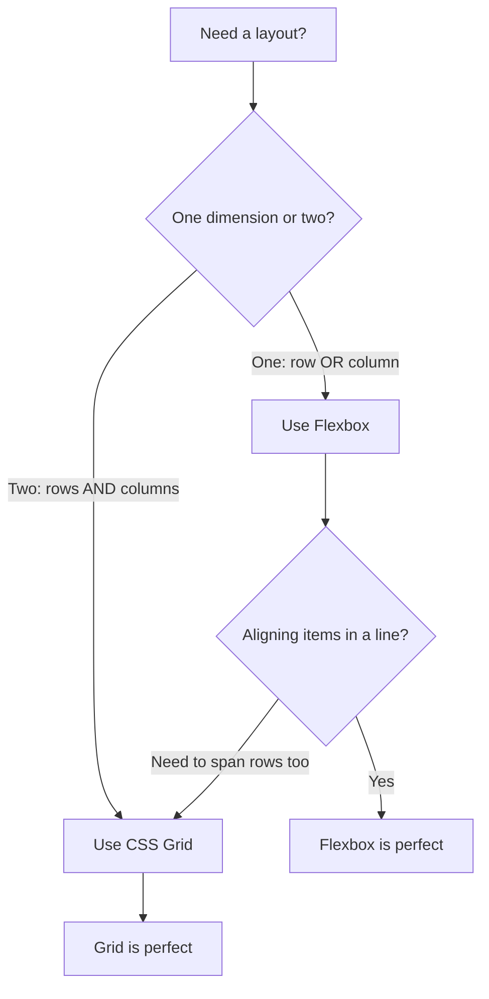
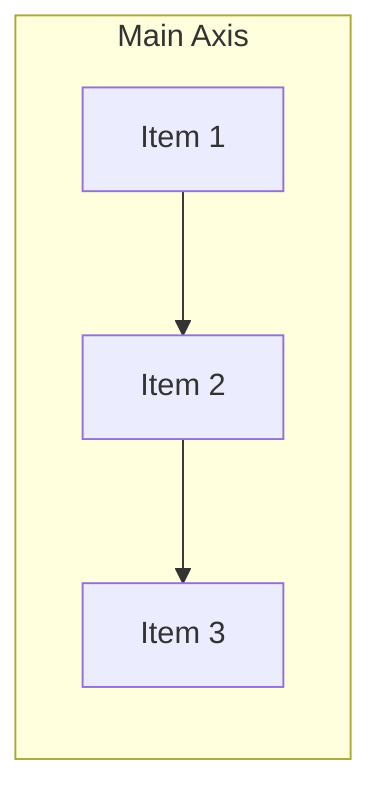

# CSS Grid vs Flexbox

Both CSS Grid and Flexbox are powerful layout systems, but they solve different problems. Here's when to reach for each.

## The Decision Tree



## Flexbox — One-Dimensional

Flexbox works along a **single axis** (row or column). It's ideal for:

- Navigation bars
- Button groups
- Centering content
- Card rows that wrap

```css
.toolbar {
  display: flex;
  gap: 1rem;
  align-items: center;
  justify-content: space-between;
}
```

### Flexbox Alignment



Items flow along the main axis and can be aligned on the cross axis.

## CSS Grid — Two-Dimensional

Grid works across **rows and columns** simultaneously. It's ideal for:

- Page-level layouts
- Card grids with consistent sizing
- Dashboard panels
- Any layout where items align both horizontally and vertically

```css
.dashboard {
  display: grid;
  grid-template-columns: 250px 1fr 1fr;
  grid-template-rows: auto 1fr auto;
  gap: 1rem;
  min-height: 100vh;
}
```

## Side-by-Side Comparison

| Feature | Flexbox | Grid |
|---------|---------|------|
| Dimensions | 1D (row or column) | 2D (rows and columns) |
| Content-first | Yes — items size themselves | No — grid defines the structure |
| Alignment | Main + cross axis | Both axes independently |
| Overlap | Not built-in | `grid-area` overlap is easy |
| Best for | Components | Page layouts |

## They Work Great Together

The real power comes from combining them. Use Grid for the overall page structure and Flexbox for component-level alignment:

```css
/* Grid for page layout */
.page {
  display: grid;
  grid-template-columns: 300px 1fr;
  min-height: 100vh;
}

/* Flexbox for the nav inside the sidebar */
.sidebar nav {
  display: flex;
  flex-direction: column;
  gap: 0.5rem;
}
```

## Rules of Thumb

1. **One direction?** → Flexbox
2. **Two directions?** → Grid
3. **Content should dictate size?** → Flexbox
4. **Layout should dictate size?** → Grid
5. **Not sure?** → Start with Flexbox, switch to Grid if you fight it
