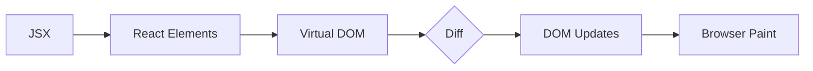

# Getting Started with React

React is a JavaScript library for building user interfaces. It lets you compose complex UIs from small, isolated pieces of code called "components."

## Why React?

- **Declarative** — describe what your UI should look like, and React handles the DOM updates.
- **Component-based** — build encapsulated components that manage their own state.
- **Learn once, write anywhere** — use it on the web, on mobile with React Native, and more.

## Your First Component

A component is just a function that returns JSX:

```jsx
function Welcome({ name }) {
  return <h1>Hello, {name}!</h1>
}
```

## How React Renders

Here's how React processes a component tree from JSX to the screen:



## State and Props

**Props** flow data downward from parent to child. **State** is data managed inside a component that can change over time.

```jsx
import { useState } from 'react'

function Counter() {
  const [count, setCount] = useState(0)
  return (
    <button onClick={() => setCount(count + 1)}>
      Clicked {count} times
    </button>
  )
}
```

## What's Next?

Once you're comfortable with components, state, and props, explore:

- **useEffect** for side effects (data fetching, subscriptions)
- **Context** for passing data without prop drilling
- **React Router** for multi-page navigation
- **Server Components** for streaming HTML from the server

Happy coding!
