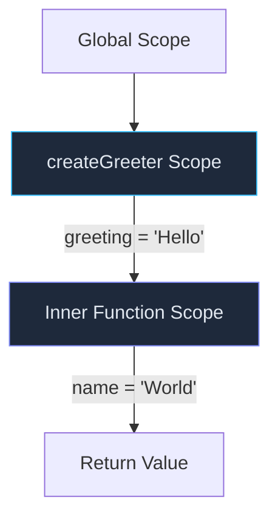

# Understanding JavaScript Closures

Closures are one of the most powerful — and most misunderstood — features in JavaScript. Let's break them down.

## What Is a Closure?

A **closure** is a function that remembers the variables from its outer scope, even after that outer function has finished running.

```js
function createGreeter(greeting) {
  return function (name) {
    return `${greeting}, ${name}!`
  }
}

const hello = createGreeter('Hello')
console.log(hello('World')) // "Hello, World!"
```

Even though `createGreeter` has returned, the inner function still has access to `greeting`. That's a closure.

## How It Works

When a function is created, it captures a reference to the surrounding **lexical environment**:



The inner function doesn't copy the variable — it holds a live reference to it.

## Common Use Cases

### Private State

```js
function createCounter() {
  let count = 0
  return {
    increment: () => ++count,
    getCount: () => count,
  }
}

const counter = createCounter()
counter.increment()
counter.increment()
console.log(counter.getCount()) // 2
```

### Event Handlers

```js
function setupButton(label) {
  document.getElementById('btn').addEventListener('click', () => {
    console.log(`${label} was clicked`)
  })
}
```

### Partial Application

```js
function multiply(a) {
  return (b) => a * b
}

const double = multiply(2)
const triple = multiply(3)

console.log(double(5))  // 10
console.log(triple(5))  // 15
```

## The Classic Loop Pitfall

```js
// Bug: all callbacks log 3
for (var i = 0; i < 3; i++) {
  setTimeout(() => console.log(i), 100)
}

// Fix: use let (block-scoped)
for (let i = 0; i < 3; i++) {
  setTimeout(() => console.log(i), 100)
}
```

With `var`, there's only one `i` shared across all iterations. With `let`, each iteration gets its own `i` — a fresh closure.

## Key Takeaways

1. A closure is a function plus its captured environment
2. Closures hold **references**, not copies
3. They enable private state, callbacks, and functional patterns
4. Use `let` or `const` in loops to avoid accidental sharing
